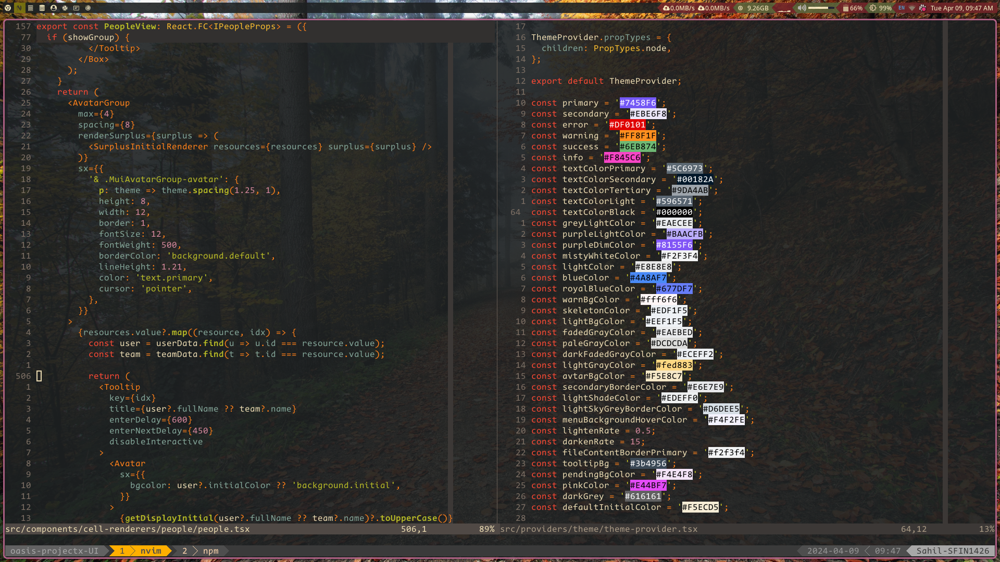

# My Dotfiles

### Tools which I use to enhance my development workflow

- Linux (Debian Based for stability)
- Neovim configured from scratch (ref: [Primeagen's video](https://www.youtube.com/watch?v=w7i4amO_zaE))
- Awesome WM configured from scratch

# Pleasant and Warm setup for eyes



# Dependencies

```console
zsh tmux kitty libx11-dev libxft-dev libxrandr-dev libxinerama-dev build-essential awesome maim ffmpegthumbnailer mpv libconfig-dev libdbus-1-dev libegl-dev libev-dev libgl-dev libepoxy-dev libpcre2-dev libpixman-1-dev libx11-xcb-dev libxcb1-dev libxcb-composite0-dev libxcb-damage0-dev libxcb-dpms0-dev libxcb-glx0-dev libxcb-image0-dev libxcb-present-dev libxcb-randr0-dev libxcb-render0-dev libxcb-render-util0-dev libxcb-shape0-dev libxcb-util-dev libxcb-xfixes0-dev libxext-dev meson ninja-build uthash-dev ninja-build gettext cmake unzip curl
```
